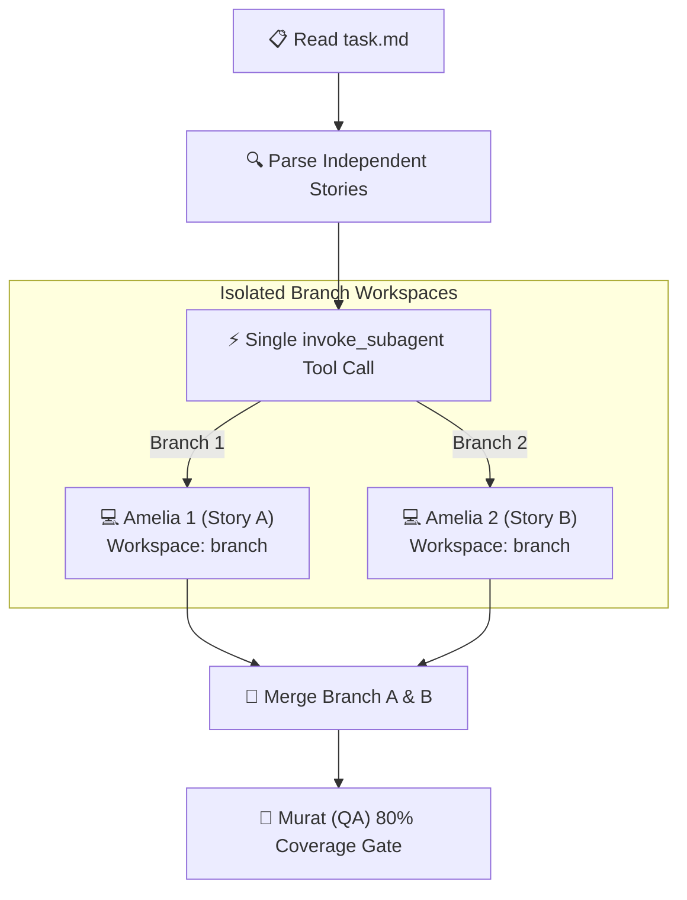

# Automated Parallel Development (`/bmad-parallel-dev`) ⚡

## Purpose
Accelerate feature velocity by automatically decomposing independent user stories in `task.md` and spawning **multiple `bmad-dev` (Amelia) subagents in parallel** using isolated workspace branches (`Workspace: branch`).

---

## Execution Flow



---

## Steps

### 1. Backlog Analysis & Slicing
Read `task.md` in the workspace root:
1. Identify all uncompleted `[ ]` stories.
2. Group stories that have **no file touchpoint overlaps** or shared dependencies into parallel batches (e.g. `Backend Auth API` vs `Frontend UI Component`).

### 2. Single-Call Parallel Subagent Invocation
Execute a single `invoke_subagent` tool call containing an array of concurrent developer subagents:

```json
{
  "Subagents": [
    {
      "TypeName": "bmad-dev",
      "Role": "Amelia (Dev - Story A)",
      "Workspace": "branch",
      "Prompt": "Implement Story A: [Title]. Follow Handoff Briefing Packet. Write TDD unit tests. Verification: pytest tests/test_story_a.py"
    },
    {
      "TypeName": "bmad-dev",
      "Role": "Amelia (Dev - Story B)",
      "Workspace": "branch",
      "Prompt": "Implement Story B: [Title]. Follow Handoff Briefing Packet. Write TDD unit tests. Verification: pytest tests/test_story_b.py"
    }
  ]
}
```

### 3. Automated Synthesis & Branch Integration
When the background subagents complete:
1. Review the execution summaries returned by each subagent.
2. Merge the completed feature branches into `main` (or active integration branch) using `git pull --rebase`.
3. Mark the corresponding items `[x]` in `task.md`.

### 4. Transition to Quality Gate
Convene **Murat (`bmad-tester`)** to execute the full test suite and confirm **≥80% code coverage gate**.
