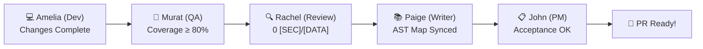

# BMAD v6 Post-Flight Release Council (`/bmad-release`) 🏆

## Purpose
Before creating a final Pull Request or merging to `main`, the **Release Council** convenes all 5 key delivery roles into a unified sign-off session to generate the verified **Quality & Security Release Certificate**.

---

## The 5-Agent Council Sign-Off Process



### Steps:

#### 1. 💻 Developer Verification (Amelia)
- Confirms all user stories in `task.md` are marked completed `[x]`.
- Confirms branch is rebased with `origin/main` (`git pull --rebase`).

#### 2. 🧪 Test & Coverage Verification (Murat)
- Executes test suite (`pytest`, `npm test`, `pest`).
- Confirms zero failures and code coverage **≥ 80%** (Akvo KPI standard).

#### 3. 🔍 Security & Code Quality Audit (Rachel)
- Inspects diff for `[SEC]`, `[DATA]`, `[ARCH]`, `[PERF]` issues.
- Confirms all numbered review findings have been resolved in 1 atomic pass.

#### 4. 📚 Living Architecture Map & Docs Sync (Paige)
- Runs `python3 .agent/scripts/generate_architecture_map.py . docs/architecture_map.md`.
- Confirms zero documentation drift between codebase AST and markdown docs.

#### 5. 📋 Product Acceptance Sign-Off (John)
- Verifies implemented features against original Functional Requirements (FR-xxx) in `docs/prd/`.

---

## Output: Release Certificate
The workflow generates the structured **Release Certificate** (from `.agent/templates/RELEASE_CERTIFICATE.md`) and automatically embeds it at the top of the PR description in Phase 6 (`/6-pr`).

```bash
# To trigger Release Council manually:
/bmad-release
```
