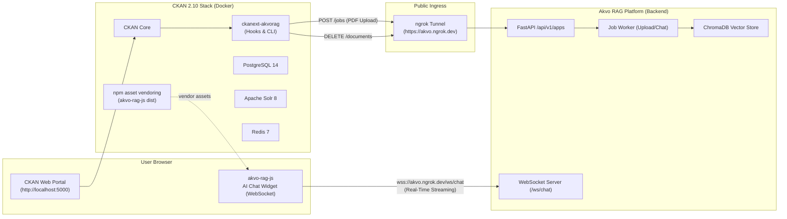

# CKAN to Akvo RAG Knowledgebase Integration PoC 🚀

[](https://github.com/wayangalihpratama/poc-ckan-rag/actions/workflows/ci.yml)
[]()
[]()
[](https://ckan.org)
[](https://github.com/akvo)

This repository is the official Proof of Concept (PoC) demonstrating **automated document lifecycle synchronization** between CKAN and **Akvo RAG**, complete with natural language conversational AI over portal documents via an embedded chatbot widget and Click CLI tools.

---

## 🌟 Architecture Overview



---

## 🛠️ Prerequisites

1. **Docker & Docker Compose** installed.
2. **Akvo RAG** running locally (in your `akvo-rag` project directory: `./dc.sh up -d`).
3. **Ngrok tunnel** exposing Akvo RAG (`ngrok http 8000 --url=akvo.ngrok.dev`).
4. **Akvo RAG Admin/User JWT Token** (from your `akvo-rag` environment or auth endpoint).

---

## 🚀 Quickstart & Complete Step-by-Step Guide

### Step 1: Start CKAN Docker Stack
From the project root:
```bash
docker compose up -d
```
Verify all 4 services (`ckan_web`, `ckan_db`, `ckan_solr`, `ckan_redis`) are healthy:
```bash
docker compose ps
```

---

### Step 2: Register CKAN with Akvo RAG

Run the interactive Click registration command:
```bash
docker compose exec -it ckan ckan akvorag register \
  --admin-token "<YOUR_AKVO_RAG_JWT_TOKEN>" \
  --app-name "CKAN Portal" \
  --domain "localhost:5000" \
  --kb-name "CKAN Knowledge Base"
```

#### What happens:
1. Calls Akvo RAG `POST /api/v1/apps/register`.
2. Generates an application access token (`tok_...`).
3. Provisions a dedicated Knowledge Base ID (e.g. `292`).
4. Prints configuration instructions.

---

### Step 3: Configure `ckan.ini`

Add the generated credentials to `docker/ckan.ini`:
```ini
# Akvo RAG Configuration
ckanext.akvorag.base_url = https://akvo.ngrok.dev
ckanext.akvorag.app_token = tok_dGWofHTCuKOIXBapQOIU1igKF1vJmf9_g5pFDL9W-0ZchIC3YLnEYiHCUUNNJX-y
ckanext.akvorag.knowledge_base_id = 292
```

Reload the configuration inside the container:
```bash
docker compose cp docker/ckan.ini ckan:/srv/app/ckan.ini
docker compose restart ckan
```

---

### Step 4: Verify Connection Status

```bash
docker compose exec -it ckan ckan akvorag status
```

**Expected Output:**
```
[*] Checking Akvo RAG status at https://akvo.ngrok.dev...

[✓] Akvo RAG Connection: OK
  App ID:            app_UtdTYF5syLfqbkJ16q_8dA
  App Name:          CKAN Portal
  Status:            active
  Target KB ID:      292
```

---

### Step 5: Log into CKAN Web Portal

1. Navigate to: **[http://localhost:5000/user/login](http://localhost:5000/user/login)**
2. Default Credentials:
   - **Username**: `admin`
   - **Password**: `ckan_admin_password`

---

### Step 6: Create a Dataset & Upload a PDF

1. Click **Datasets** ➔ **Add Dataset** (`http://localhost:5000/dataset/new`).
2. Enter Title (e.g. `Water Sanitation Study 2026`) and click **Next: Add Data**.
3. Under **Upload**, choose any PDF document (e.g. `tests/fixtures/sample_water_report.pdf`).
4. Click **Finish**.
5. **Observe Automatic Sync**: CKAN's `after_resource_create` hook will immediately detect the PDF and dispatch an upload job to Akvo RAG.

---

### Step 7: Interact with the AI Assistant

#### Method A: In-Portal Floating Chat Widget
1. Click the circular blue **AI Assistant** button in the bottom right corner of any page.
2. Ask any question about your uploaded documents:
   > *"What was the average pH level recorded in the reservoir?"*
3. Receive answers with source citations and page numbers.

#### Method B: Terminal CLI
Query the Knowledge Base directly from your terminal:
```bash
docker compose exec -it ckan ckan akvorag query "What was the average pH level recorded in the reservoir?"
```

---

### Step 8: Bulk Sync Existing Documents
If you have existing datasets that were created prior to enabling the extension, run:
```bash
docker compose exec -it ckan ckan akvorag sync-all
```

---

### Step 9: Automatic Document Purging
When you delete a PDF resource or an entire dataset from CKAN:
1. `ckanext-akvorag` intercepts the deletion event (`after_resource_delete` / `after_package_delete`).
2. Dispatches a purge request to Akvo RAG (`DELETE /api/v1/apps/knowledge-bases/{kb_id}/documents/{doc_id}`).
3. Associated vector embeddings in ChromaDB are instantly deleted.

---

## 📦 Frontend Asset Management (`akvo-rag-js`)

The extension tracks the official [`akvo-rag-js`](https://github.com/akvo/akvo-rag-js) NPM package:
- **`package.json`**: Declares `"akvo-rag-js": "^1.2.2"`.
- **Vendoring Script**: `npm run build:assets` copies compiled bundle assets (`akvo-rag.js`, `akvo-rag.css`, and fonts) to `ckanext/akvorag/public/`.
- **Docker Auto-Build**: The Docker container automatically runs `npm install` and `npm run build:assets` during startup.

```bash
# Install / update NPM package
npm install

# Re-vendor assets into CKAN public directory
npm run build:assets
```

---

## 🧪 Automated Testing & CI/CD

### Local Execution
Execute the full test suite (52 tests, 92% coverage) inside the isolated container environment:
```bash
./run_tests.sh
```

### GitHub Actions CI Workflow
Continuous Integration is configured via [`.github/workflows/ci.yml`](.github/workflows/ci.yml). On every `push` and `pull_request` targeting `main`:
1. Spawns Docker Compose stack.
2. Waits for service readiness.
3. Executes `./run_tests.sh` and verifies the minimum **≥80% coverage gate**.

---

## 📚 Documentation Index
- [Local CKAN Docker Setup QA Guide](docs/qa/qa-guide-issue-2.md)
- [Akvo RAG Client Library QA Guide](docs/qa/qa-guide-issue-4.md)
- [CKAN Plugin Hooks QA Guide](docs/qa/qa-guide-issue-6.md)
- [CKAN Click CLI Commands QA Guide](docs/qa/qa-guide-issue-8.md)
- [Chatbot Widget UI Embedding QA Guide](docs/qa/qa-guide-issue-10.md)
- [End-to-End Verification Runbook](docs/qa/qa-guide-issue-12.md)
