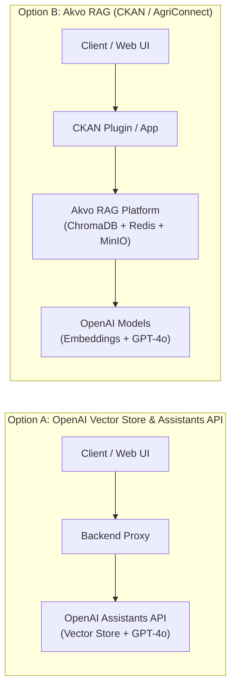
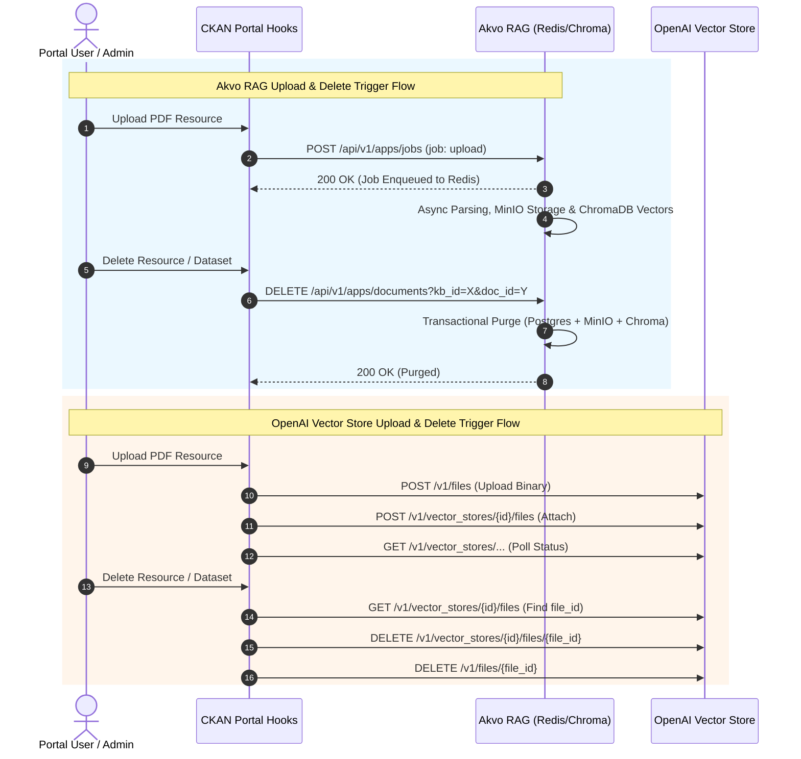

# Architecture Decision: Akvo RAG vs. OpenAI Vector Store

**Status**: Decision Guide & Reference  
**Context**: Evaluation of RAG architectures across Akvo platforms (CKAN, MIS, AgriConnect)  
**Primary Focus**: Document Upload and Delete Trigger Synchronization  
**Authors**: Akvo Engineering & AI Team  

---

## 1. Executive Summary

When evaluating conversational AI / RAG for Akvo platforms, two primary architecture patterns exist:

1. **Option A — OpenAI Vector Store & Assistants API**: Fully managed, serverless RAG using OpenAI Assistants API & Vector Store.
2. **Option B — Akvo RAG Pipeline (`ckanext-akvorag`)**: Self-hosted, multi-tenant RAG platform using ChromaDB, PostgreSQL, Redis, MinIO, and OpenAI models (implemented and verified in `ckanext-akvorag` PoC).



---

## 2. Deep Dive: Document Upload & Delete Triggers

The primary requirement in data portals (like CKAN) is **lifecycle trigger synchronization**: automatically indexing newly uploaded documents and immediately purging vectors when documents or entire datasets are deleted.

### Lifecycle Trigger Comparison

| Lifecycle Trigger Event | Option A: OpenAI Vector Store & Assistants | Option B: Akvo RAG Pipeline (`ckanext-akvorag`) | Which is Better? |
| :--- | :--- | :--- | :---: |
| **1. Document Upload / Create** | 1. Upload file binary via `POST /v1/files`<br>2. Attach file to vector store via `POST /v1/vector_stores/{id}/files`<br>3. Poll batch status until completed. | 1. Send single job request to `POST /api/v1/apps/jobs`<br>2. Redis queue processes ingestion & embedding asynchronously in background.<br>3. Async callback parameters returned to CKAN. | **Option B (Akvo RAG)**<br>Single async dispatch; no multi-step REST polling. |
| **2. Document Update / Re-upload** | Requires finding old `file_id`, deleting from vector store, deleting file, uploading new file, and re-attaching. | `POST /api/v1/apps/jobs` with same filename replaces metadata and updates vector index automatically. | **Option B (Akvo RAG)**<br>Native idempotent re-indexing. |
| **3. Single Document Delete** | 1. Query vector store file list to find `file_id` (or look up in local DB)<br>2. `DELETE /v1/vector_stores/{id}/files/{file_id}`<br>3. `DELETE /v1/files/{file_id}` | `DELETE /api/v1/apps/documents?kb_id={kb_id}&doc_id={doc_id}`<br>(or by filename). Instantly purges DB metadata, MinIO storage, and Chroma vectors in one call. | **Option B (Akvo RAG)**<br>Atomic single-call purge. |
| **4. Bulk / Cascade Dataset Delete** | Must execute $2 \times N$ API calls to OpenAI per resource in the dataset, subject to external API rate limits. | CKAN `IPackageController.delete` hook purges all dataset resources locally across Postgres & ChromaDB in <50ms. | **Option B (Akvo RAG)**<br>Fast, reliable cascade deletion. |
| **5. Error Handling & Rate Limits** | External HTTP failures, OpenAI upload timeouts (504), or rate limits (429) can leave orphaned vector files. | Handled in local Redis queue with native retries and transactional rollbacks. | **Option B (Akvo RAG)**<br>Fault-tolerant & resilient. |



---

## 3. Which Architecture is Better for Document Triggers?

### 🏆 Verdict: **Akvo RAG is significantly better for upload/delete triggers.**

#### Why Akvo RAG Wins on Triggers:
1. **Zero External API Latency on User Actions**: When a user clicks "Delete Resource" in the portal UI, CKAN only needs a single local network call. OpenAI requires multiple round-trips (`lookup ➔ detach ➔ delete file`), which can slow down web UI response times or timeout.
2. **No ID Mapping Debt**: In OpenAI Vector Store, host applications must maintain a persistent mapping between CKAN resource IDs and OpenAI's internal `file-xxxxxxxx` IDs. With Akvo RAG, documents are mapped directly to CKAN resource metadata and filenames.
3. **Resilience Against Rate Limits**: If a portal administrator bulk-uploads or deletes 50 datasets, OpenAI Vector Store APIs can trigger `429 Too Many Requests`. Akvo RAG processes bursts seamlessly via local Redis queues.

---

## 4. Overall Architecture Comparison

| Dimension | Option A: OpenAI Vector Store & Assistants | Option B: Akvo RAG Pipeline (`ckanext-akvorag`) |
| :--- | :--- | :--- |
| **Architecture** | **Serverless (Black Box)**<br>OpenAI handles parsing, chunking, indexing, search, and reranking. | **Dedicated Microservices**<br>Postgres (metadata), ChromaDB (vectors), Redis (queues), MinIO (files). |
| **Operational Model** | **SaaS / Cloud Only**<br>No local infrastructure needed; managed by OpenAI. | **Self-Hosted / Managed**<br>Full control over storage, databases, and worker processes. |
| **Retrieval Control** | **Fixed / Automatic**<br>Cannot customize chunk size, overlap, or hybrid BM25 search. | **Full Control**<br>Custom chunk sizes, overlap, hybrid search, and citation extractors. |
| **Metadata Filtering** | **Basic / Limited**<br>Limited key-value filtering on search. | **Advanced**<br>Full SQL & vector filtering (filter by organization, permissions, tags). |
| **Cost Model** | • **Vector Storage**: $0.10 / GB / day (~$3.00 / GB / month)<br>• **Chat**: Standard token pricing. | • **Vector Storage**: $0 (self-hosted ChromaDB)<br>• **Embeddings**: $0.02 / 1M tokens (one-time)<br>• **Chat**: Standard token pricing. |
| **Data Privacy** | Raw files and embeddings stored on OpenAI cloud. | Raw files stored in local MinIO; embeddings in local ChromaDB. |

---

## 5. Use Case Recommendations

### 📘 Static Documentation & App Help Centers ➔ **Option A (OpenAI Vector Store & Assistants)**
- **Use Case**: In-app AI help assistant answering questions from user guides, Sphinx/RST manuals, and release notes.
- **Knowledge Source**: Static platform documentation compiled into PDF/Markdown.
- **Trigger Needs**: **None / Low** (documents are uploaded once per software release).
- **Verdict**: **Option A is optimal**. Simple, lightweight, and maintenance-free for static help documentation.

### 📦 Dynamic Data Portals (`poc-ckan-rag`) ➔ **Option B (Akvo RAG Pipeline)**
- **Use Case**: Conversational Q&A over portal datasets, research reports, and survey publications.
- **Knowledge Source**: Dynamic user-uploaded/deleted PDF resources across various organizations.
- **Trigger Needs**: **High / Mission-Critical** (must trigger instant indexing on upload and instant vector purges on delete).
- **Verdict**: **Option B is optimal**. Provides transactional lifecycle synchronization without API rate limits or external ID mapping overhead.

---

## 6. Summary Decision Tree

```
Does the platform require automated Document Upload / Delete triggers?
  ├── NO  (Static documentation, help center, manual batch upload)
  │    └──► Choose Option A (OpenAI Vector Store & Assistants)
  │
  └── YES (Dynamic portal, users upload/delete datasets regularly)
       └──► Choose Option B (Akvo RAG Pipeline)
```
