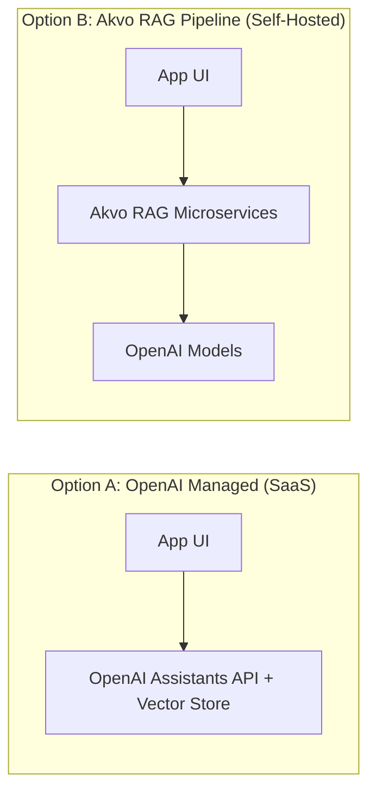
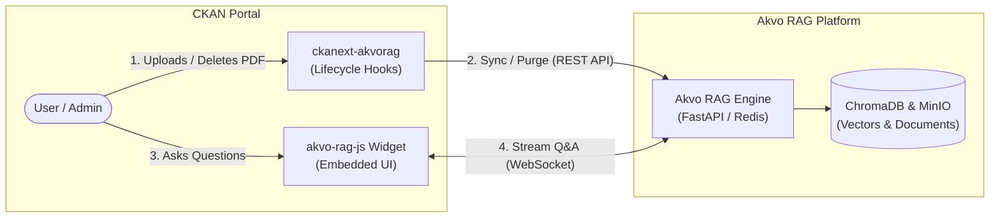

# Executive Brief: RAG Architecture Evaluation & Decision

**Prepared For**: Management & Technical Leadership  
**Topic**: Conversational AI Architecture Selection for Akvo Platforms  
**Date**: September 2026  

---

## 1. The Decision in Brief

We evaluated two architectural patterns for integrating conversational AI across Akvo applications:

1. **Option A — OpenAI Vector Store & Assistants API**: Fully managed SaaS solution hosted entirely on OpenAI cloud.
2. **Option B — Akvo RAG Pipeline (`ckanext-akvorag`)**: Self-hosted microservice platform (PostgreSQL, Redis, MinIO, ChromaDB) connected to OpenAI models.



---

## 2. Key Findings

### ⚡ 1. Document Upload & Delete Triggers (Primary Evaluated Metric)
* **Option A (OpenAI)**: Requires multi-step external API round-trips (`upload ➔ attach ➔ poll status` on upload; `lookup ➔ detach ➔ delete` on delete). Deleting a dataset with multiple files makes $2 \times N$ external API calls, creating UI lag and rate limit risks.
* **Option B (Akvo RAG)**: Executes in a single non-blocking async job (`POST /api/v1/apps/jobs`) on upload, and an atomic single-call purge (`DELETE /api/v1/apps/documents`) in <50ms on delete. **Akvo RAG is significantly superior for dynamic portal lifecycle sync.**

### 🏷️ 2. Metadata Filtering & Multi-Tenancy
* **Option A (OpenAI)**: Global search with limited key-value filtering. Cannot easily restrict queries by complex database relations (e.g. user organizations, dataset visibility, licenses).
* **Option B (Akvo RAG)**: Supports granular SQL and vector pre-filtering, ensuring users only retrieve answers from datasets they have permission to access.

### 💰 3. Cost & Operational Maintenance
* **Option A (OpenAI)**: Zero local infrastructure to manage. Incurs a recurring vector storage fee of **$0.10 / GB / day (~$3.00 / GB / month)** in addition to per-query token fees.
* **Option B (Akvo RAG)**: **$0 vector storage cost** (self-hosted ChromaDB). Incurs one-time embedding generation ($0.02 / 1M tokens) + per-query token fees. Requires running and maintaining 4 Docker services.

---

## 3. CKAN Extension Lifecycle Hooks Leveraged

The `ckanext-akvorag` plugin connects CKAN to the Akvo RAG platform via two distinct channels: **automated background sync** (via lifecycle hooks) and **real-time conversational UI** (via the embedded widget).



### Lifecycle Hook Mapping

| CKAN Interface | Lifecycle Hook Method | Trigger Event | Akvo RAG Interaction |
| :--- | :--- | :--- | :--- |
| **`IResourceController`** | `after_resource_create` | File/PDF uploaded to dataset | Dispatches non-blocking async ingestion job (`POST /api/v1/apps/jobs`). |
| **`IResourceController`** | `after_resource_update` | File replaced or metadata edited | Re-indexes file in Akvo RAG to refresh vector embeddings. |
| **`IResourceController`** | `before_resource_delete` | Individual resource deleted | Executes instant transactional purge (`DELETE /api/v1/apps/documents`). |
| **`IPackageController`** | `delete(entity)` | Entire dataset deleted | Cascades purges across all attached resources in the dataset. |
| **`ITemplateHelpers`** | `get_helpers()` | CKAN web page rendering | Injects knowledgebase ID, WebSocket URL, and chat widget configs. |
| **`IConfigurer`** | `update_config()` | CKAN portal startup | Registers custom Jinja templates and `akvo-rag-js` frontend bundle. |
| **`IClick`** | `get_commands()` | CKAN CLI execution | Registers `ckan akvorag [register\|status\|sync-all]` commands. |

---

## 4. High-Level Comparison Matrix

| Criteria | Option A: OpenAI Vector Store | Option B: Akvo RAG Pipeline |
| :--- | :--- | :--- |
| **Best For** | Static product manuals, FAQs, help centers | Dynamic data portals (CKAN), user uploads/deletions |
| **Trigger Performance** | Slower (multi-step cloud REST calls & polling) | Fast & Atomic (<50ms local/VPC transactional purge) |
| **Infrastructure Overhead** | **Zero** (Serverless, fully managed by OpenAI) | **Moderate** (Runs PostgreSQL, Redis, Chroma, MinIO) |
| **Metadata & Org Filtering** | Basic / Limited | Advanced (SQL + Vector metadata scoping) |
| **Vector Storage Cost** | ~$3.00 / GB / month | $0 (Self-hosted) |
| **Data Privacy** | Files & embeddings stored on OpenAI cloud | Files & embeddings remain within own servers |

---

## 5. Final Recommendation & Decision Rule

```
Does the platform have frequent, user-driven Document Uploads and Deletions?
  ├── NO  (Static docs, help manuals, release notes) ──► Choose Option A (OpenAI Vector Store)
  └── YES (Data portals like CKAN, dataset reports)  ──► Choose Option B (Akvo RAG Pipeline)
```

### Strategic Allocation:
* **For Product Help Centers & User Guides**: Adopt **Option A (OpenAI Vector Store)** to eliminate maintenance overhead for static documents.
* **For CKAN & Dynamic Data Portals**: Adopt **Option B (Akvo RAG Pipeline)** to ensure robust upload/delete trigger synchronization, multi-organization security, and zero external rate limits.

