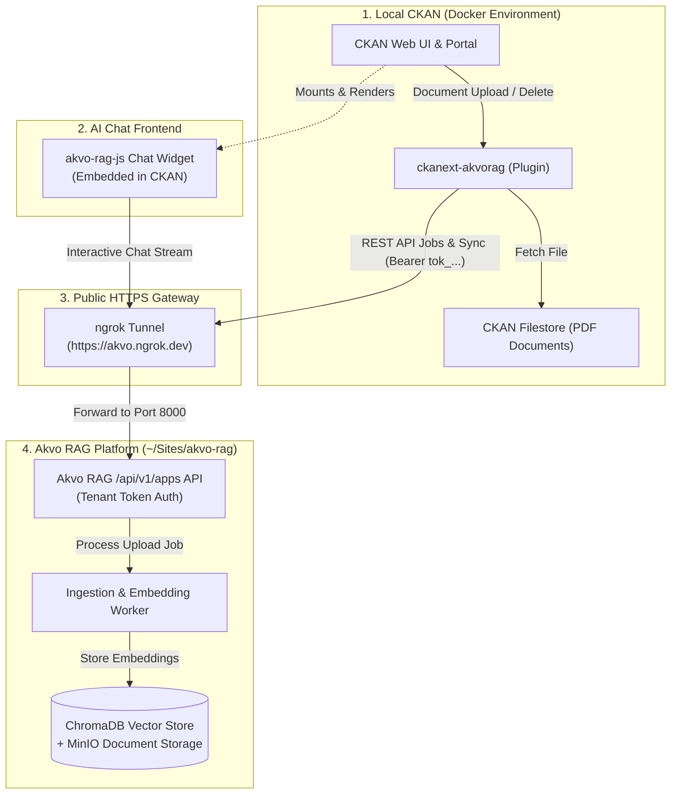
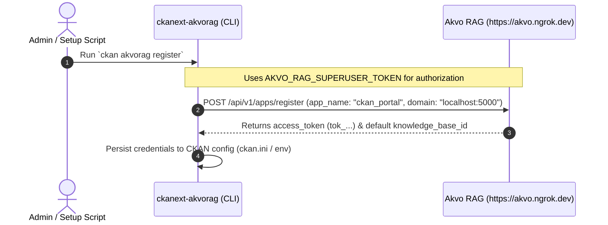
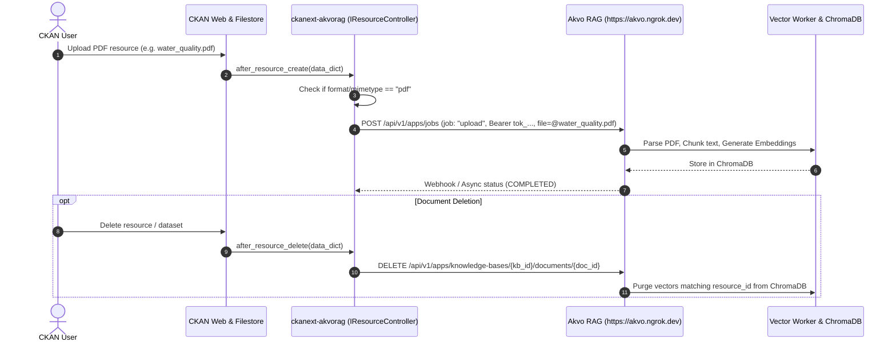
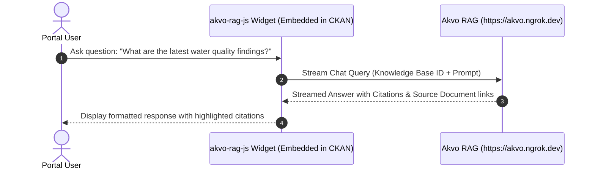

# Feature Spec: CKAN to Akvo RAG Knowledgebase Sync & AI Assistant

## Overview
This feature provides an automated, event-driven integration between **CKAN** (as the document & dataset manager) and **Akvo RAG** (as the AI retrieval & knowledgebase platform).

When PDF documents are uploaded, updated, or deleted in CKAN:
1. **Upload Trigger**: CKAN automatically sends the PDF to Akvo RAG via `/api/v1/apps/jobs`, chunking and indexing it into ChromaDB.
2. **Delete Trigger**: Deleting a PDF resource or dataset in CKAN purges its corresponding vectors from the Akvo RAG Knowledge Base.
3. **AI Chatbot**: Users interact with the knowledgebase using the official **`akvo-rag-js`** widget embedded directly inside CKAN or a standalone page.

---

## Network & Service Architecture

---

## 5W1H Requirements

| Dimension | Specification |
|---|---|
| **Who** | Data managers uploading reports/PDFs and portal users asking questions. |
| **What** | Real-time PDF sync into Akvo RAG Knowledge Base and embedded `akvo-rag-js` chatbot. |
| **Where** | Local CKAN (Docker), `ckanext-akvorag` plugin, Akvo RAG (`https://akvo.ngrok.dev`), and `akvo-rag-js`. |
| **When** | Triggered instantly on CKAN resource lifecycle events (`after_resource_create`, `after_resource_delete`). |
| **Why** | Transforms static CKAN document repositories into a conversational, AI-searchable knowledgebase. |
| **How** | Custom CKAN extension using `IResourceController` hooks + `/api/v1/apps` tenant endpoints. |

---

## Sequence Flows

### 1. App Registration (One-time Bootstrap)

### 2. Document Upload & Lifecycle Sync

### 3. AI Chat with `akvo-rag-js`

---

## Key Components

### 1. CKAN Extension: `ckanext-akvorag`
- **`plugin.py`**:
  - Implements `IResourceController`, `IPackageController`, `IConfigurer`, `ITemplateHelpers`.
  - Hooks into `after_resource_create`, `after_resource_update`, and `after_resource_delete`.
- **`client.py` (`AkvoRAGClient`)**:
  - Encapsulates `/api/v1/apps` endpoints (registration via superuser token, upload jobs with tenant token, deletion, status checks).
- **`cli.py`**:
  - `ckan akvorag register`: Automates app registration using superuser token.
  - `ckan akvorag status`: Checks connection to Akvo RAG (`/api/v1/apps/me`).
  - `ckan akvorag sync-all`: Bulk-indexes existing PDF resources across datasets.
- **Templates & UI (`akvo-rag-js` integration)**:
  - Injects `akvo-rag-js` bundle and stylesheet into CKAN dataset and portal views.

### 2. Local Environment (`docker-compose.yml`)
- **CKAN 2.10** container with Python 3.10.
- **PostgreSQL 14** (CKAN metadata DB + DataStore DB).
- **Solr 8** (CKAN search index).
- **Redis** (Caching and background jobs).
- **Environment**: Configured with `AKVO_RAG_BASE_URL=https://akvo.ngrok.dev`.

### 3. Akvo RAG Host Service
- Running in `~/Sites/akvo-rag` exposed via `ngrok http 8000 --url=akvo.ngrok.dev`.

---

## Verification & Testing Plan

### Automated Tests
- **`pytest tests/test_client.py`**: Tests `AkvoRAGClient` handling app registration (with superuser token), upload job dispatch, and deletion.
- **`pytest tests/test_plugin.py`**: Tests `IResourceController` event dispatch on mock PDF create/delete payloads.
- **`pytest tests/test_cli.py`**: Tests Click CLI commands.

### Manual Verification Steps
1. **Expose Akvo RAG**: Run `ngrok http 8000 --url=akvo.ngrok.dev` from `~/Sites/akvo-rag`.
2. **Start CKAN**: Run `docker compose up -d` and initialize CKAN database.
3. **Register Extension**: Execute `ckan akvorag register --admin-token=<SUPERUSER_TOKEN>`.
4. **Upload PDF**: Upload a test PDF file via CKAN web interface (`http://localhost:5000`).
5. **Verify Ingest**: Verify Akvo RAG worker logs confirm PDF parsing and chunk indexing.
6. **Chat with `akvo-rag-js`**: Ask questions in the embedded chatbot widget and verify grounded citations.
7. **Delete PDF**: Delete the PDF resource in CKAN and verify vector purge.

---

## Epic & Vibe Coding Estimation ⏱️

- **Confidence Level**: High
- **Dependencies**: `~/Sites/akvo-rag`, `akvo-rag-js`, Docker, Ngrok.

| Task ID | Component & Description | Dev | Automated Testing | QA & Review | Total Est. | Priority |
| :--- | :--- | :---: | :---: | :---: | :---: | :--- |
| **TASK-01** | Local CKAN Docker Environment (`docker-compose.yml`, Solr 8, Postgres 14, Redis) | 35m | 15m | 15m | **65m (1.1h)** | Must Have |
| **TASK-02** | `AkvoRAGClient` with Superuser Registration & `/api/v1/apps` Job Handlers | 30m | 25m | 15m | **70m (1.2h)** | Must Have |
| **TASK-03** | `ckanext-akvorag` plugin core (`IResourceController` upload/delete hooks) | 45m | 30m | 20m | **95m (1.6h)** | Must Have |
| **TASK-04** | CKAN CLI Commands (`register`, `status`, `sync-all`) | 25m | 20m | 15m | **60m (1.0h)** | Must Have |
| **TASK-05** | `akvo-rag-js` Chatbot Widget Embedding in CKAN Templates | 30m | 15m | 15m | **60m (1.0h)** | Must Have |
| **TASK-06** | End-to-End Verification (Ngrok tunnel ➔ PDF upload ➔ RAG sync ➔ Chat ➔ Delete) | 30m | 20m | 20m | **70m (1.2h)** | Must Have |
| **TOTAL** | **Full PoC Implementation** | **195m** | **125m** | **100m** | **420m (7.0h)** | |
