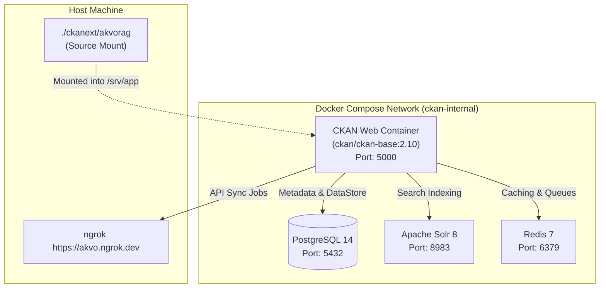

# Feature Spec 001: Local CKAN Docker Environment

## Overview
Provides a self-contained local Docker Compose environment to run CKAN 2.10 with all required services (PostgreSQL 14, Solr 8, and Redis), pre-configured to mount our `ckanext-akvorag` extension in development mode and communicate with the local Akvo RAG service.

---

## Architecture & Container Topology



---

## 1. Technical Deliverables

### 1.1 `docker-compose.yml`
- **`ckan`**:
  - Base Image: `ckan/ckan-base:2.10` (or Dockerfile building with Python 3.10).
  - Volumes: `./ckanext/akvorag:/srv/app/ckanext-akvorag:rw`, `ckan_storage:/var/lib/ckan`.
  - Environment: `CKAN_SITE_URL=http://localhost:5000`, `CKAN_PLUGINS=stats text_view image_view datastore datapusher akvorag`.
  - Networking: `extra_hosts: ["host.docker.internal:host-gateway"]`.
- **`db`**: PostgreSQL 14 with `ckan_default` database and `datastore_default` database.
- **`solr`**: Solr 8 with CKAN schema pre-configured (`ckan/ckan-solr:2.10`).
- **`redis`**: Redis Alpine.

### 1.2 Configuration Files
- `/.env.example`: Standardized environment variable template.
- `/docker/Dockerfile`: CKAN container Dockerfile installing `ckanext-akvorag` in editable mode (`pip install -e /srv/app/ckanext-akvorag`).
- `/docker/setup.sh`: Database initialization script (`ckan db init`).

---

## 2. Verification & Testing

### 2.1 Automated Health Checks
- Docker compose container healthchecks for PostgreSQL (`pg_isready`), Solr (`curl http://localhost:8983/solr/admin/cores?action=STATUS`), and CKAN (`curl -f http://localhost:5000/api/3/action/status_show`).

### 2.2 Manual Verification
```bash
docker compose up -d
docker compose ps
curl http://localhost:5000/api/3/action/status_show
```

---

## 3. Vibe Coding Estimation ⏱️

| Subtask | Dev | Testing | QA & Review | Total |
| :--- | :---: | :---: | :---: | :---: |
| Docker Compose & Dockerfile Definition | 20m | 10m | 5m | **35m** |
| Postgres, Solr 8, and Redis Provisioning | 10m | 5m | 5m | **20m** |
| Networking & Extension Volume Mount | 5m | - | 5m | **10m** |
| **TOTAL** | **35m** | **15m** | **15m** | **65m (1.1h)** |
