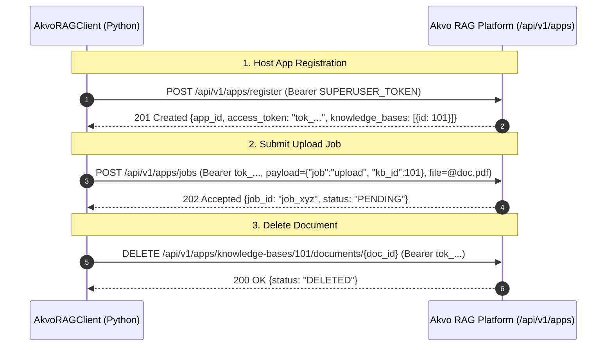

# Feature Spec 002: Akvo RAG Client Library

## Overview
Implements the Python integration client (`AkvoRAGClient`) that interfaces directly with Akvo RAG's `/api/v1/apps` endpoints (per `APP_REGISTRATION.md`), supporting app registration with superuser admin credentials, asynchronous document upload jobs, document deletion, and health validation.

---

## Architecture & API Contract



---

## 1. Technical Deliverables

### 1.1 Client Library
**File**: `/ckanext/akvorag/client.py`
- Class `AkvoRAGClient`:
  - `__init__(base_url: str, app_token: Optional[str] = None)`
  - `register_app(app_name: str, domain: str, superuser_token: str, chat_callback: Optional[str] = None, upload_callback: Optional[str] = None) -> dict`
  - `get_me() -> dict`: Calls `GET /api/v1/apps/me` to verify credentials.
  - `list_knowledge_bases() -> list`: Calls `GET /api/v1/apps/knowledge-bases`.
  - `submit_upload_job(file_path: str, filename: str, kb_id: int, callback_params: dict) -> dict`: Sends multipart form to `POST /api/v1/apps/jobs`.
  - `delete_document(kb_id: int, document_id: str) -> dict`: Calls `DELETE /api/v1/apps/knowledge-bases/{kb_id}/documents/{doc_id}`.
  - `ask_question(prompt: str, kb_ids: list[int], session_id: Optional[str] = None) -> dict`: Calls `POST /api/v1/apps/jobs` (`job: "chat"`).

---

## 2. Verification & Testing

### 2.1 Automated Unit Tests
**File**: `/tests/test_client.py`
- Mocks HTTP requests with `responses` or `pytest-mock` / `unittest.mock`.
- Test cases:
  - `test_register_app_success()`
  - `test_register_app_unauthorized()`
  - `test_submit_upload_job_success()`
  - `test_submit_upload_job_file_not_found()`
  - `test_delete_document_success()`
  - `test_get_me_active_status()`

### 2.2 Test Command
```bash
pytest tests/test_client.py -v --cov=ckanext.akvorag.client
```

---

## 3. Vibe Coding Estimation ⏱️

| Subtask | Dev | Testing | QA & Review | Total |
| :--- | :---: | :---: | :---: | :---: |
| Client Core Methods & Error Handling | 15m | 10m | 5m | **30m** |
| Multipart Upload & App Registration with Superuser Token | 15m | 10m | 5m | **30m** |
| Unit Test Suite (Mocked HTTP & Edge Cases) | - | 5m | 5m | **10m** |
| **TOTAL** | **30m** | **25m** | **15m** | **70m (1.2h)** |
