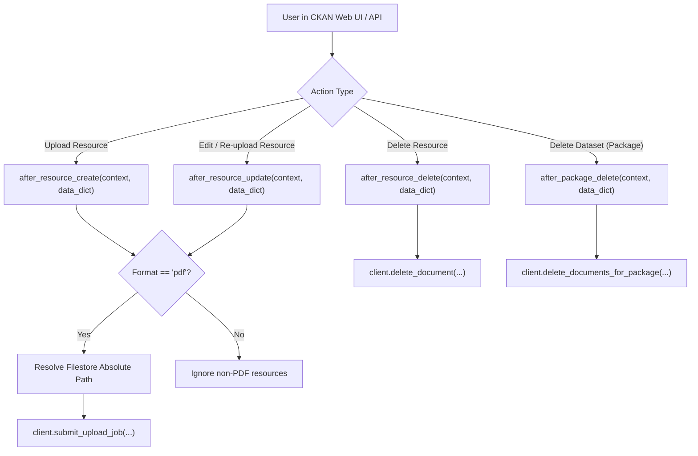

# Feature Spec 003: Core CKAN Plugin Hooks (`ckanext-akvorag`)

## Overview
Implements the CKAN plugin lifecycle extension that automatically intercepts PDF document uploads, updates, and deletions in CKAN, invoking the `AkvoRAGClient` to keep the Akvo RAG Knowledge Base in continuous synchronization.

---

## Architecture & Lifecycle Hooks



---

## 1. Technical Deliverables

### 1.1 Plugin Class
**File**: `/ckanext/akvorag/plugin.py`
- Implements:
  - `ckan.plugins.interfaces.IResourceController`
  - `ckan.plugins.interfaces.IPackageController`
  - `ckan.plugins.interfaces.IConfigurer`
- Methods:
  - `update_config(config)`: Reads `ckanext.akvorag.base_url`, `ckanext.akvorag.app_token`, `ckanext.akvorag.knowledge_base_id`.
  - `after_resource_create(context, data_dict)`: Inspects format/mimetype, fetches file path from CKAN filestore (`ckan.storagepath`), dispatches upload job.
  - `after_resource_update(context, data_dict)`: If file changed, triggers re-indexing.
  - `after_resource_delete(context, data_dict)`: Extracts stored `document_id` / `resource_id` and calls delete.
  - `after_package_delete(context, data_dict)`: Purges all associated resources for the deleted package.

### 1.2 Setup & Packaging
**File**: `/setup.py` & `/ckanext/__init__.py` & `/ckanext/akvorag/__init__.py`

---

## 2. Verification & Testing

### 2.1 Automated Unit Tests
**File**: `/tests/test_plugin.py`
- Tests plugin initialization, configuration loading, and hook firing with mock CKAN data dictionaries.
- Test cases:
  - `test_after_resource_create_with_pdf()`
  - `test_after_resource_create_with_csv_ignored()`
  - `test_after_resource_delete_triggers_rag_purge()`
  - `test_after_package_delete_purges_all_package_resources()`

### 2.2 Test Command
```bash
pytest tests/test_plugin.py -v --cov=ckanext.akvorag.plugin
```

---

## 3. Vibe Coding Estimation ⏱️

| Subtask | Dev | Testing | QA & Review | Total |
| :--- | :---: | :---: | :---: | :---: |
| `IResourceController` & `IPackageController` Hook Logic | 25m | 15m | 10m | **50m** |
| CKAN Storage Path Resolution & Mimetype Filtering | 10m | 10m | 5m | **25m** |
| Unit Test Suite for Lifecycle Events | 10m | 5m | 5m | **20m** |
| **TOTAL** | **45m** | **30m** | **20m** | **95m (1.6h)** |
