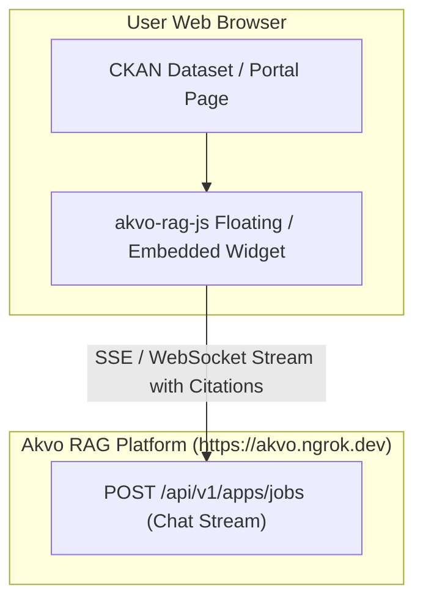

# Feature Spec 005: `akvo-rag-js` Chatbot Widget Embedding

## Overview
Integrates the official **[`akvo-rag-js`](https://github.com/akvo/akvo-rag-js)** chatbot widget into the CKAN web interface, enabling portal visitors to ask natural language questions directly grounded in the synced PDF knowledge base.

---

## Architecture & UI Integration



---

## 1. Technical Deliverables

### 1.1 Jinja Template Integration
**Directory**: `/ckanext/akvorag/templates/`
- `ckanext/akvorag/templates/package/read.html` (Dataset View):
  - Injects `akvo-rag-js` widget container configured with the dataset/knowledge base scope.
- `ckanext/akvorag/templates/akvorag/chat_widget.html`:
  - Embeds the `akvo-rag-js` script tag and configuration snippet:
  ```html
  <script src="https://cdn.jsdelivr.net/npm/@akvo/akvo-rag-js/dist/akvo-rag.min.js"></script>
  <div id="akvo-rag-chat" 
       data-endpoint="https://akvo.ngrok.dev" 
       data-kb-id="{{ h.akvorag_get_kb_id() }}">
  </div>
  <script>
    AkvoRAG.init({
      container: '#akvo-rag-chat',
      endpoint: 'https://akvo.ngrok.dev',
      knowledgeBaseId: {{ h.akvorag_get_kb_id() | tojson }},
      title: 'CKAN AI Knowledge Assistant'
    });
  </script>
  ```

### 1.2 Template Helpers
**File**: `/ckanext/akvorag/helpers.py`
- `akvorag_get_kb_id()`: Returns configured Knowledge Base ID.
- `akvorag_get_endpoint()`: Returns configured public RAG endpoint URL.

---

## 2. Verification & Testing

### 2.1 Automated Tests
**File**: `/tests/test_templates.py`
- Tests template helper functions and verifies HTML snippet generation with correct endpoint attributes.

### 2.2 Manual Verification
1. Open CKAN dataset page in browser (`http://localhost:5000/dataset/...`).
2. Verify floating/docked AI Chatbot widget appears.
3. Submit a query and verify streaming answer with highlighted source citations.

---

## 3. Vibe Coding Estimation ⏱️

| Subtask | Dev | Testing | QA & Review | Total |
| :--- | :---: | :---: | :---: | :---: |
| Template Overrides & Jinja Chat Widget Injection | 15m | 10m | 5m | **30m** |
| Template Helpers & Config Injection | 10m | 5m | 5m | **20m** |
| Cross-Browser Verification & CSS Styling | 5m | - | 5m | **10m** |
| **TOTAL** | **30m** | **15m** | **15m** | **60m (1.0h)** |
