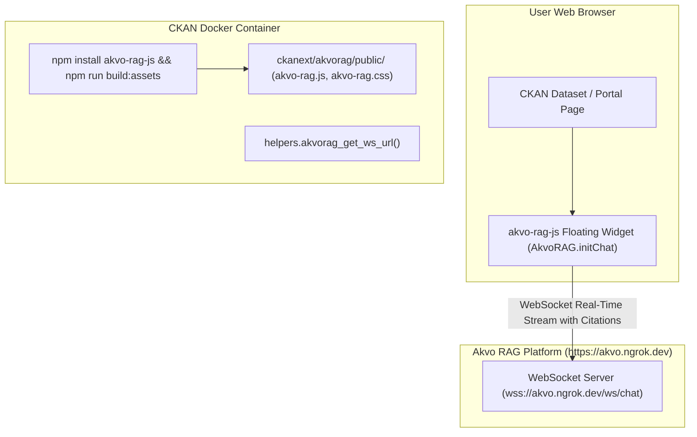

# Feature Spec 005: `akvo-rag-js` Chatbot Widget Embedding

## Overview
Integrates the official **[`akvo-rag-js`](https://github.com/akvo/akvo-rag-js)** chatbot widget into the CKAN web interface, enabling portal visitors to ask natural language questions directly grounded in the synced PDF knowledge base.

---

## Architecture & UI Integration



---

## 1. Technical Deliverables

### 1.1 Package Management & Vendoring
- **`package.json`**: Tracks official dependency `"akvo-rag-js": "^1.2.2"`.
- **`scripts/vendor-assets.js`**: `npm run build:assets` copies production bundles (`akvo-rag.js`, `akvo-rag.css`, font assets) to `ckanext/akvorag/public/`.
- **Docker Auto-Vendoring**: `docker/entrypoint.sh` automatically installs dependencies and vendors assets on container initialization.

### 1.2 Jinja Template Integration
**Directory**: `/ckanext/akvorag/templates/`
- `ckanext/akvorag/templates/package/read.html` (Dataset View):
  - Injects dataset AI assistant container with defensive dictionary checks.
- `ckanext/akvorag/templates/akvorag/snippets/chat_widget.html`:
  - Embeds the official `akvo-rag.css` and `akvo-rag.js` and initializes `AkvoRAG.initChat`:
  ```html
  <link rel="stylesheet" href="https://cdnjs.cloudflare.com/ajax/libs/font-awesome/4.7.0/css/font-awesome.min.css">
  <link rel="stylesheet" href="/akvo-rag.css">
  <script src="/akvo-rag.js"></script>
  <script>
    document.addEventListener("DOMContentLoaded", function() {
      if (window.AkvoRAG && typeof window.AkvoRAG.initChat === 'function') {
        window.AkvoRAG.initChat({
          title: "{{ h.akvorag_get_widget_config().title }}",
          kb_id: {{ h.akvorag_get_kb_id() or 'null' }},
          wsURL: "{{ h.akvorag_get_ws_url() }}",
          autoReconnect: true
        });
      }
    });
  </script>
  ```

### 1.3 Template Helpers
**File**: `/ckanext/akvorag/helpers.py`
- `akvorag_get_kb_id()`: Returns configured Knowledge Base ID.
- `akvorag_get_endpoint()`: Returns configured public RAG endpoint URL.
- `akvorag_get_ws_url()`: Computes or returns WebSocket URL (`wss://.../ws/chat`).
- `akvorag_get_widget_config()`: Serializes configuration dictionary for templates.

---

## 2. Verification & Testing

### 2.1 Automated Tests
**File**: `/tests/test_templates.py`
- Tests template helper functions and verifies HTML snippet generation with correct endpoint attributes.

### 2.2 Manual Verification
1. Open CKAN dataset page in browser (`http://localhost:5000/dataset/...`).
2. Verify floating/docked AI Chatbot widget appears.
3. Submit a query and verify streaming answer with highlighted source citations.

---

## 3. Vibe Coding Estimation ⏱️

| Subtask | Dev | Testing | QA & Review | Total |
| :--- | :---: | :---: | :---: | :---: |
| Template Overrides & Jinja Chat Widget Injection | 15m | 10m | 5m | **30m** |
| Template Helpers & Config Injection | 10m | 5m | 5m | **20m** |
| Cross-Browser Verification & CSS Styling | 5m | - | 5m | **10m** |
| **TOTAL** | **30m** | **15m** | **15m** | **60m (1.0h)** |
