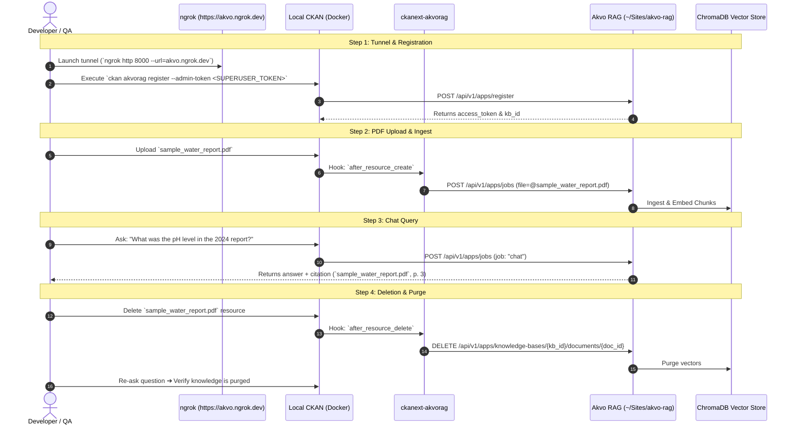

# Feature Spec 006: End-to-End Verification Suite & Runbook

## Overview
Defines the end-to-end (E2E) integration test harness, verification script, and step-by-step runbook to validate the complete lifecycle:
1. Ngrok HTTPS tunnel activation.
2. CKAN host app registration with superuser token.
3. PDF upload in CKAN ➔ automatic Akvo RAG ingestion into ChromaDB.
4. AI Chatbot query via `akvo-rag-js` returning grounded source citations.
5. PDF deletion in CKAN ➔ automatic vector purge.

---

## E2E Verification Workflow



---

## 1. Technical Deliverables

### 1.1 E2E Test Runner Script
**File**: `/tests/e2e_verification.py`
- Automates the 4-step lifecycle validation against live running services.
- Outputs a clean test report with timestamps and assertion statuses.

### 1.2 Sample Test Artifacts
**Directory**: `/tests/fixtures/`
- `sample_water_report.pdf`: Standard test PDF containing verifiable facts and tables.

---

## 2. Verification Runbook Steps

```bash
# 1. Start Akvo RAG
cd ~/Sites/akvo-rag && ./dc.sh up -d

# 2. Expose via Ngrok
ngrok http 8000 --url=akvo.ngrok.dev

# 3. Start CKAN
cd /Users/galihpratama/Dev/poc-ckan-rag && docker compose up -d

# 4. Run E2E Verification Script
pytest tests/e2e_verification.py -v
```

---

## 3. Vibe Coding Estimation ⏱️

| Subtask | Dev | Testing | QA & Review | Total |
| :--- | :---: | :---: | :---: | :---: |
| E2E Test Harness Script & Fixture Preparation | 15m | 10m | 10m | **35m** |
| Live Service Verification & Edge Case Auditing | 15m | 10m | 10m | **35m** |
| **TOTAL** | **30m** | **20m** | **20m** | **70m (1.2h)** |
