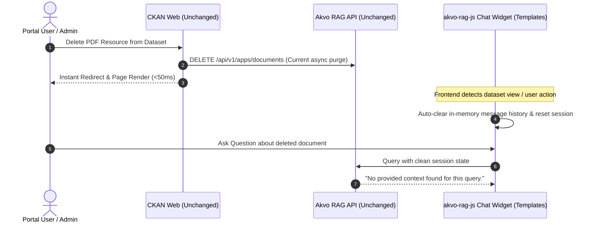

# Feature Specification: Lightweight Session Invalidation (007)

**Feature**: 007 — Lightweight Session Invalidation  
**Initiative**: CKAN to Akvo RAG Knowledgebase Integration PoC  
**Target Delivery**: Phase 0 (Planning & Estimation)  
**Status**: Ready for Implementation  

---

## 1. Executive Summary & Problem Analysis

| Dimension | Description |
| :--- | :--- |
| **Problem** | After deleting a document in CKAN, the AI chatbot continues answering from the deleted file if queried in the active chat window. After a browser refresh, it returns *"no provided context"*. |
| **Root Cause** | The active `akvo-rag-js` WebSocket chat session retains previous conversational history in the LLM context window. The vector store is purged, but the LLM uses previous turn history in memory. |
| **Solution** | **Frontend-Only Session Invalidation**: Immediately reset in-memory chat history and restart WebSocket session on document modification/deletion. |
| **Backend Impact** | **No Backend Changes (Keep As Is)**: CKAN plugin hooks (`plugin.py`) and client (`client.py`) already handle deletion and remain untouched. |
| **User Impact** | **Zero UI Lag**: CKAN operations remain instant (<50ms). Stale conversational memory is eliminated immediately. |

---

## 2. Architecture & Logic Flow



---

## 3. Scope of Changes

### 3.1 Frontend Chatbot Templates (`ckanext/akvorag/templates/`) — **[IN SCOPE]**
- In `chat_widget.html`: Add a lightweight session reset mechanism (`window.AkvoRAGReset()`) to clear DOM messages and re-establish a fresh WebSocket connection when viewing updated datasets.
- In `package/read.html`: When clicking **"Ask AI About This Dataset"**, trigger a fresh session bootstrap.

### 3.2 Backend Implementation (`ckanext/akvorag/`) — **[NO CHANGES / KEEP AS IS]**
- `ckanext/akvorag/plugin.py`: **Keep as is** (lifecycle hooks already implement delete triggers).
- `ckanext/akvorag/client.py`: **Keep as is** (REST client already implements document purge endpoints).

---

## 4. Verification & Testing Plan

### 4.1 Automated Test Suite
```bash
docker compose exec -T ckan pytest tests/test_templates.py tests/test_plugin.py -v
```
- Verify template helpers and snippet structure support clean session resets without breaking existing functionality.

### 4.2 Manual Verification Walkthrough
1. Upload a PDF dataset (`sample_water_report.pdf`).
2. Ask the chatbot: *"What is the water pH level?"* ➔ Confirm answer with citation.
3. Delete the PDF resource from CKAN.
4. Click **"Ask AI About This Dataset"** and ask: *"What is the water pH level?"*
5. **Expected Result**: Immediate response: *"No provided context"* (zero ghost memory, zero deletion wait time).

---

## 5. Vibe Coding Task Breakdown & Estimation ⏱️

| Task ID | Task Description | Dev (Amelia) | Testing (Murat) | QA & Review (Rachel) | Total Est. |
| :--- | :--- | :---: | :---: | :---: | :---: |
| **TASK-07.1** | Add client-side session auto-reset in `chat_widget.html` | 15m | 10m | 5m | **30m (0.5h)** |
| **TASK-07.2** | Connect dataset "Ask AI" button to clean session bootstrap | 10m | 10m | 5m | **25m (0.4h)** |
| **TASK-07.3** | Automated template regression tests | 10m | 10m | 5m | **25m (0.4h)** |
| **TOTAL** | **Feature 007 Implementation & Verification** | **35m** | **30m** | **15m** | **80m (1.3h)** |
