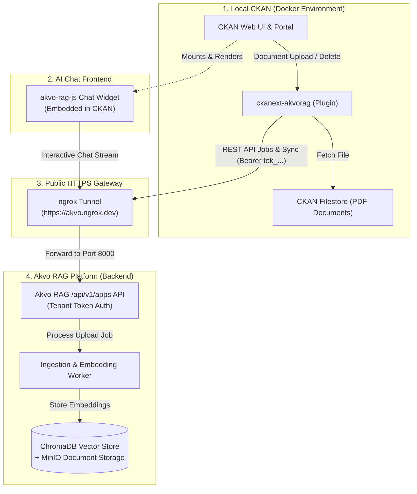
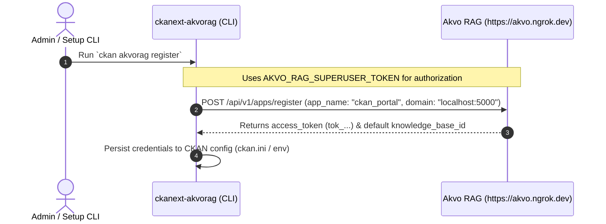
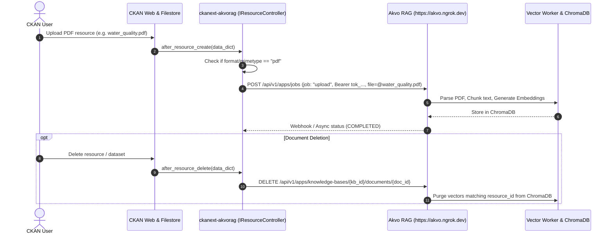
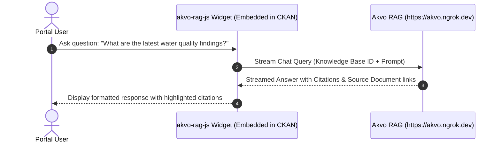

# Project LLD: CKAN to Akvo RAG Knowledgebase Sync & AI Assistant

## 1. System Architecture & Topology

---

## 2. Sequence Diagrams

### 2.1 App Registration (One-time Setup)

### 2.2 Document Upload & Lifecycle Sync

### 2.3 AI Chat Interaction (`akvo-rag-js`)

---

## 3. Component Details & Data Contracts

### 3.1 CKAN Plugin (`ckanext/akvorag/plugin.py`)
- Implements: `IResourceController`, `IPackageController`, `IConfigurer`, `ITemplateHelpers`, `IClick`.
- Hook definitions:
  - `after_resource_create(context, data_dict)`
  - `after_resource_update(context, data_dict)`
  - `before_resource_delete(context, resource, resources)`
  - `after_resource_delete(context, data_dict)`
  - `delete(entity)` (PackageController)
  - `after_dataset_delete(context, data_dict)`

### 3.2 Akvo RAG Client (`ckanext/akvorag/client.py`)
- Encapsulates `/api/v1/apps` REST interactions:
  - `register_app(app_name, domain, superuser_token)` ➔ `tok_...`, `knowledge_base_id`
  - `submit_upload_job(file_path, filename, callback_params)` ➔ `job_id`
  - `delete_document(kb_id, document_id)` ➔ status
  - `delete_document_by_name(kb_id, filename)` ➔ status
  - `get_me()` ➔ app status
  - `submit_chat_job(prompt, kb_id)` ➔ answer + citations

### 3.3 CLI Interface (`ckanext/akvorag/cli.py`)
- `ckan akvorag register`: Registers the host application and provisions a default KB.
- `ckan akvorag status`: Checks connection, token validity, and active KB configuration.
- `ckan akvorag sync-all`: Bulk-scans existing PDF resources across all datasets.
- `ckan akvorag query`: Direct CLI conversational Q&A over the knowledgebase.

### 3.4 Frontend Integration (`akvo-rag-js`)
- Embedded in CKAN layout via Jinja template extension (`ckanext/akvorag/templates/`).
- Initialized with target Knowledge Base ID, public endpoint, and WebSocket streaming URL.

---

## 4. Verification & Testing Strategy

### 4.1 Automated Test Suite
- `pytest tests/test_client.py`: Unit tests mocking Akvo RAG `/api/v1/apps` responses.
- `pytest tests/test_plugin.py`: Unit tests for `IResourceController` and `IPackageController` hook execution.
- `pytest tests/test_helpers.py`: Unit tests for template helper functions and URL resolvers.
- `pytest tests/test_templates.py`: Unit tests for template rendering and widget snippets.
- `pytest tests/test_cli.py`: Click CLI runner tests for all 4 commands.
- `pytest tests/test_e2e.py`: Hermetic end-to-end integration tests with mocked API backends.

### 4.2 End-to-End Verification
- Complete verification loop: Start ngrok ➔ Register CKAN app ➔ Upload PDF ➔ Verify vector chunking in Akvo RAG ➔ Query via `akvo-rag-js` ➔ Delete PDF in CKAN ➔ Verify vector purge.

---

## 5. Implementation Task Mapping & Vibe Coding Time Estimation ⏱️

| Task ID | Implementation Area & Feature Spec | Touchpoint Files / Deliverables | Dev | Testing | QA & Review | Total Est. |
| :--- | :--- | :--- | :---: | :---: | :---: | :---: |
| **TASK-01** | **[Local CKAN Docker Environment](docs/features/001_local_ckan_docker_spec.md)** | `docker-compose.yml`, `Dockerfile`, `.env.example`, `ckan.ini` | 35m | 15m | 15m | **65m (1.1h)** |
| **TASK-02** | **[Akvo RAG Client Library](docs/features/002_akvo_rag_client_spec.md)** | `ckanext/akvorag/client.py`, `tests/test_client.py` | 30m | 25m | 15m | **70m (1.2h)** |
| **TASK-03** | **[Core CKAN Plugin Hooks](docs/features/003_ckanext_akvorag_plugin_spec.md)** | `ckanext/akvorag/plugin.py`, `tests/test_plugin.py` | 45m | 30m | 20m | **95m (1.6h)** |
| **TASK-04** | **[CKAN Click CLI Commands](docs/features/004_ckan_cli_commands_spec.md)** | `ckanext/akvorag/cli.py`, `tests/test_cli.py` | 25m | 20m | 15m | **60m (1.0h)** |
| **TASK-05** | **[akvo-rag-js UI Embedding](docs/features/005_akvo_rag_js_widget_spec.md)** | `ckanext/akvorag/templates/`, `ckanext/akvorag/fanstatic/` | 30m | 15m | 15m | **60m (1.0h)** |
| **TASK-06** | **[End-to-End Verification Runbook](docs/features/006_end_to_end_verification_spec.md)** | End-to-end integration test & verification runbook | 30m | 20m | 20m | **70m (1.2h)** |
| **TOTAL** | **Full PoC Implementation** | | **195m** | **125m** | **100m** | **420m (7.0h)** |
