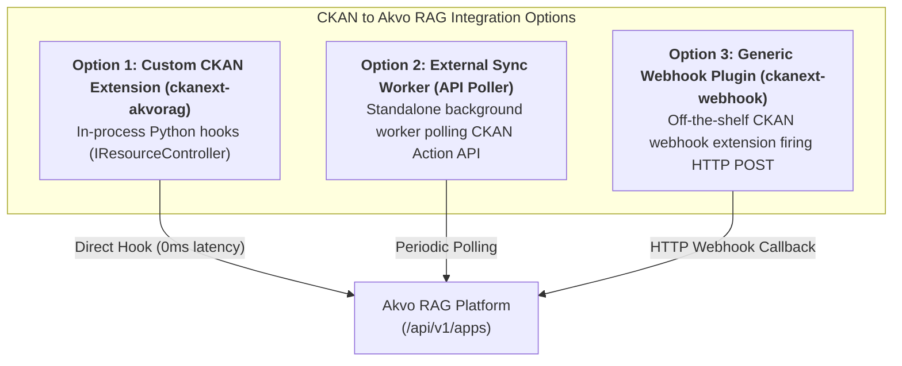

# Project PRD: CKAN to Akvo RAG Knowledgebase Sync PoC

## 1. Executive Summary & Goals
This Proof of Concept (PoC) establishes an automated, event-driven bridge between **CKAN** (open data and document catalog) and **Akvo RAG** (multi-tenant AI knowledgebase platform located at `~/Sites/akvo-rag`).

### Primary Objectives:
1. **Automated Knowledge Ingestion**: Automatically detect when PDF documents are uploaded or updated in CKAN, and stream them into an Akvo RAG Knowledge Base.
2. **Lifecycle Vector Purge**: Ensure document deletions in CKAN immediately purge the corresponding vector chunks from ChromaDB.
3. **Conversational AI Interface**: Enable portal users to query the ingested documents using the official **`akvo-rag-js`** widget embedded directly inside CKAN.
4. **Integration Pattern Evaluation**: Formally evaluate and benchmark 3 integration options (Custom Plugin, External Poller, and Generic Webhook).

---

## 2. 5W1H Requirements Analysis

| Dimension | Specification |
|---|---|
| **Who** | Data managers uploading reports/PDFs and portal users asking questions. |
| **What** | Real-time PDF sync into Akvo RAG Knowledge Base and embedded `akvo-rag-js` chatbot. |
| **Where** | Local CKAN (Docker), `ckanext-akvorag` plugin, Akvo RAG (`https://akvo.ngrok.dev`), and `akvo-rag-js`. |
| **When** | Triggered instantly on CKAN resource lifecycle events (`after_resource_create`, `after_resource_delete`). |
| **Why** | Transforms static CKAN document repositories into a conversational, AI-searchable knowledgebase. |
| **How** | Custom CKAN extension using `IResourceController` hooks + `/api/v1/apps` tenant endpoints. |

---

## 3. Integration Options Evaluation

### Comparative Analysis Matrix

| Dimension | Option 1: Custom Plugin (`ckanext-akvorag`) ⭐ *(Selected)* | Option 2: External Sync Worker (API Poller) | Option 3: Generic Webhook Extension |
| :--- | :--- | :--- | :--- |
| **How it Works** | Hooks directly into CKAN's internal Python lifecycle (`after_resource_create`, `after_resource_delete`). | Standalone Python process calling `package_search` and `activity_list` on a timer. | Off-the-shelf CKAN webhook plugin emits HTTP events to a receiver. |
| **CKAN Code Access** | **Required** (plugin installed in CKAN environment). | **Zero modifications** (works with 100% stock/hosted 3rd-party CKAN). | **Plugin required** (installs generic webhook plugin). |
| **Event Latency** | **Instant (0ms)** | **Near real-time** (polling interval e.g. 30s-1m). | **Instant (sub-second)** |
| **Handling Deletions** | ✅ **Flawless**: Hook fires with deleted `resource_id`. | ⚠️ **Complex**: Requires snapshot diffing to detect deleted files. | ⚠️ **Moderate**: Dependent on webhook payload capabilities. |
| **File Access** | Direct access to local filestore path or stream. | Must download file over public HTTP API. | Must download file over public HTTP API. |
| **UI Integration** | ✅ Injects `akvo-rag-js` chat widget & sync badges into CKAN pages. | ❌ None (external only). | ❌ None (external only). |
| **Verdict** | **Primary Choice for PoC**: Ideal for self-hosted/Docker CKAN. | **Best for 3rd-party hosted CKAN** without code access. | **Best when central webhook hub exists**. |

---

## 4. Scope & Phasing

### Phase 1: Core Lifecycle Sync (In Scope for PoC)
- [x] Local CKAN 2.10 Docker environment with Solr 8, Postgres 14, and Redis.
- [x] `ckanext-akvorag` plugin with `IResourceController` & `IPackageController` hooks.
- [x] Akvo RAG `/api/v1/apps` client with superuser app registration.
- [x] HTTPS tunneling via `ngrok http 8000 --url=akvo.ngrok.dev`.
- [x] Embedded `akvo-rag-js` chatbot widget in CKAN templates.
- [x] PDF format filtering and document deletion purge.

### Phase 2: Advanced Extensions (Future Roadmap)
- Tabular data sync (CSV / DataStore extraction).
- Organization-based multi-KB routing (mapping CKAN organizations to separate Akvo RAG Knowledge Bases).
- External polling worker fallback for 3rd-party CKAN instances.

---

## 5. Epic & Vibe Coding Estimation Breakdown ⏱️

- **Confidence Level**: High
- **Dependencies**: `~/Sites/akvo-rag`, `akvo-rag-js`, Docker & Docker Compose, Ngrok.

| Task ID | Component & Description | Vibe Coding (Dev) | Automated Testing | QA & Review | Total Est. Time | Priority |
| :--- | :--- | :---: | :---: | :---: | :---: | :--- |
| **TASK-00** | Project PRD & LLD Architecture Planning & Options Evaluation | 30m | - | 15m | **45m (0.75h)** | Done ✅ |
| **TASK-01** | Local CKAN Docker Setup (`docker-compose.yml`, Solr 8, Postgres 14, Redis) | 35m | 15m | 15m | **65m (1.1h)** | Must Have |
| **TASK-02** | `AkvoRAGClient` with Superuser Registration & `/api/v1/apps` Job Handlers | 30m | 25m | 15m | **70m (1.2h)** | Must Have |
| **TASK-03** | `ckanext-akvorag` plugin core (`IResourceController` upload/delete hooks) | 45m | 30m | 20m | **95m (1.6h)** | Must Have |
| **TASK-04** | CKAN CLI Commands (`register`, `status`, `sync-all`) | 25m | 20m | 15m | **60m (1.0h)** | Must Have |
| **TASK-05** | `akvo-rag-js` Chatbot Widget Embedding in CKAN Templates | 30m | 15m | 15m | **60m (1.0h)** | Must Have |
| **TASK-06** | End-to-End Verification (Ngrok tunnel ➔ PDF upload ➔ RAG sync ➔ Chat ➔ Delete) | 30m | 20m | 20m | **70m (1.2h)** | Must Have |
| **TOTAL** | **Full PoC Implementation** | **225m** | **125m** | **115m** | **465m (7.75h)** | |
