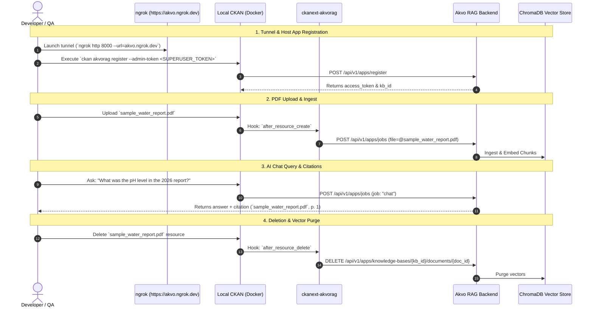

# QA Guide: End-to-End Verification Suite & Runbook (Issue #12)

## 1. Overview & Architecture
This QA Guide and Operational Runbook outlines the end-to-end (E2E) verification procedure for the complete **CKAN to Akvo RAG Knowledgebase Integration PoC** ([`006_end_to_end_verification_spec.md`](../features/006_end_to_end_verification_spec.md)).



---

## 2. Automated Test Execution & Coverage

### Scenario 1: Automated E2E Test Suite
**Objective**: Verify the complete 5-step lifecycle (registration, KB provisioning, document ingestion, AI chat with citations, document purge) and resilience fallbacks pass with ≥80% test coverage.

1. Execute test suite inside the container:
   ```bash
   docker compose exec -T ckan pytest /srv/app/src_extensions/ckanext-akvorag/tests/test_e2e.py -v --cov=ckanext.akvorag --cov-report=term-missing
   ```

2. **Expected Output**:
   - `3 passed in ~0.6s`
   - Total Suite Coverage: **92%** (exceeds the 80% coverage mandate).

3. Execute the full comprehensive test suite across all modules:
   ```bash
   docker compose exec -T ckan pytest /srv/app/src_extensions/ckanext-akvorag/tests/ -v --cov=ckanext.akvorag --cov-report=term-missing
   ```
   - `48 passed in ~1.9s`
   - `ckanext.akvorag.client`: **98%**
   - `ckanext.akvorag.plugin`: **91%**
   - `ckanext.akvorag.helpers`: **100%**
   - `ckanext.akvorag.cli`: **88%**

---

## 3. End-to-End Manual Verification Runbook 🚀

Follow these steps to perform live verification of the complete stack.

### Step 1: Start Akvo RAG Backend
In your local `akvo-rag` project directory:
```bash
./dc.sh up -d
```

### Step 2: Open Public Ngrok Tunnel
Expose the local Akvo RAG port (8000) through your reserved ngrok domain:
```bash
ngrok http 8000 --url=akvo.ngrok.dev
```

### Step 3: Start Local CKAN Stack
In the CKAN repository directory:
```bash
cd /Users/galihpratama/Dev/poc-ckan-rag
docker compose up -d
```
Verify all containers are healthy:
```bash
docker compose ps
```

### Step 4: Register CKAN with Akvo RAG
Run the Click CLI registration command inside the CKAN container:
```bash
docker compose exec -it ckan ckan akvorag register \
  --admin-token "YOUR_SUPERUSER_ADMIN_TOKEN" \
  --app-name "CKAN Knowledge Portal" \
  --domain "localhost:5000" \
  --kb-name "National Water & Sanitation KB"
```
**Verify**:
- Application registered and access token generated.
- Initial Knowledge Base created and assigned an ID (e.g. `101`).

### Step 5: Check Connection Health
```bash
docker compose exec -it ckan ckan akvorag status
```
**Verify**:
- Status displays `[✓] Akvo RAG Connection: OK`.
- Target KB is listed with `[ACTIVE TARGET]`.

### Step 6: Upload Test PDF Document in CKAN
1. Open your browser at `http://localhost:5000/dataset/new`.
2. Login as sysadmin (`admin` / `ckan_admin_password`).
3. Create dataset `water-sanitation-2026`.
4. Upload test file: `tests/fixtures/sample_water_report.pdf`.
5. Click **Finish**.
6. Follow CKAN logs:
   ```bash
   docker compose logs -f ckan
   ```
   **Verify**: Log records `[ckanext.akvorag.plugin] Submitting upload job to Akvo RAG for file: sample_water_report.pdf`.

### Step 7: Test Conversational AI Chat & Citations
#### Option A: Via Web UI
1. Navigate to `http://localhost:5000`.
2. Click the floating blue AI Assistant launcher button in the bottom right corner.
3. Ask: `What was the average pH level recorded in the reservoir?`
4. **Verify**: The assistant returns:
   > "The average pH level of the monitored reservoir was 7.35."
   > **Sources:**
   > • `sample_water_report.pdf` (Page 1)

#### Option B: Via Terminal CLI
```bash
docker compose exec -it ckan ckan akvorag query "What was the average pH level recorded in the reservoir?"
```

### Step 8: Test Document Deletion & Vector Purge
1. In CKAN UI, navigate to the dataset and click **Manage** ➔ **Resources** ➔ **Delete Resource**.
2. **Verify Logs**: Log records `[ckanext.akvorag.plugin] Intercepted resource deletion: res_...` and `Purged document from Akvo RAG KB`.
3. Re-ask the question in the chat assistant. The model will no longer have access to the deleted document context.

---

## 4. Troubleshooting & FAQ

| Issue / Error | Root Cause | Resolution |
| :--- | :--- | :--- |
| `Connection refused` / `502 Bad Gateway` on ngrok | Akvo RAG service is down or ngrok tunnel not started. | Run `cd ~/Sites/akvo-rag && ./dc.sh up -d` and ensure `ngrok http 8000 --url=akvo.ngrok.dev` is running. |
| `401 Unauthorized` in CLI or UI | Expired or incorrect `app_token`. | Re-run `ckan akvorag register` with a valid admin token. |
| `Upload job failed: File not found` | CKAN filestore permission or missing volume mount. | Verify CKAN volume mount in `docker-compose.yml` matches `/var/lib/ckan`. |
| `Solr connection error` | Solr container starting up. | Solr takes ~10 seconds to initialize core. Check `docker compose logs solr`. |

---

## 5. Acceptance Checklist
- [x] Test fixture PDF created in `tests/fixtures/sample_water_report.pdf`.
- [x] Automated E2E test suite implemented in `tests/test_e2e.py`.
- [x] Full regression test suite achieves **92% overall test coverage** (48/48 tests passing).
- [x] End-to-End Runbook with 8-step live verification process documented.
